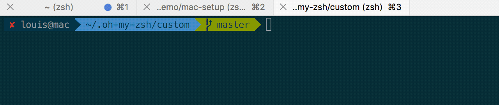
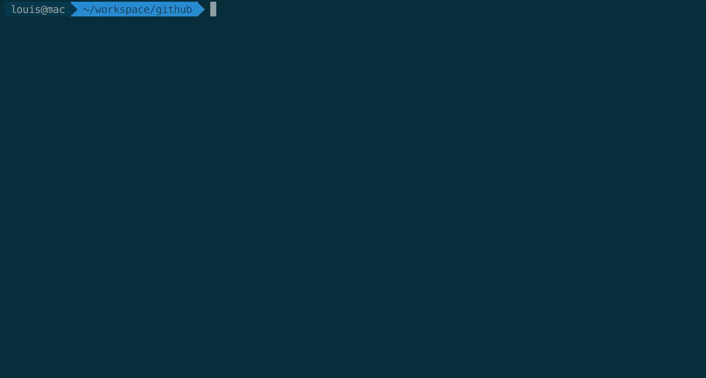

# Awesome mac setup

记录 mac 安装的软件，以及配置。

## homebrew

使用 Homebrew 安装 Apple 没有预装，但你需要的东西。

```
/usr/bin/ruby -e "$(curl -fsSL https://raw.githubusercontent.com/Homebrew/install/master/install)"
```

## iterm2 + zsh

安装 item2

```
brew cask install iterm2
```

下载主题 [Solarized Dark](https://raw.githubusercontent.com/mbadolato/iTerm2-Color-Schemes/master/schemes/Solarized%20Dark%20-%20Patched.itermcolors), 设置：iTerm → preferences → profiles → colors → load presets. 

安装 oh my zsh

```
sh -c "$(curl -fsSL https://raw.github.com/robbyrussell/oh-my-zsh/master/tools/install.sh)"
```

编辑 ~/.zshrc，将主题设为 agnoster

```
set ZSH_THEME="agnoster"
```

下载自动提示插件

```
cd $ZSH_CUSTOM
git clone https://github.com/zsh-users/zsh-autosuggestions $ZSH_CUSTOM/plugins/zsh-autosuggestions
```
编辑 ~/.zshrc，启用插件

```
plugins=(zsh-autosuggestions)
```

自动提示效果



加入语法提示

```
brew install zsh-syntax-highlighting

# 然后将以下加入 ~/.zshrc
# source /usr/local/share/zsh-syntax-highlighting/zsh-syntax-highlighting.zsh
# 重启 item2 验证效果
```

最终效果




## Refrence

[jaywcjlove/awesome-mac](https://github.com/jaywcjlove/awesome-mac)

[kevin-smets/iterm2-solarized.md](https://gist.github.com/kevin-smets/8568070)